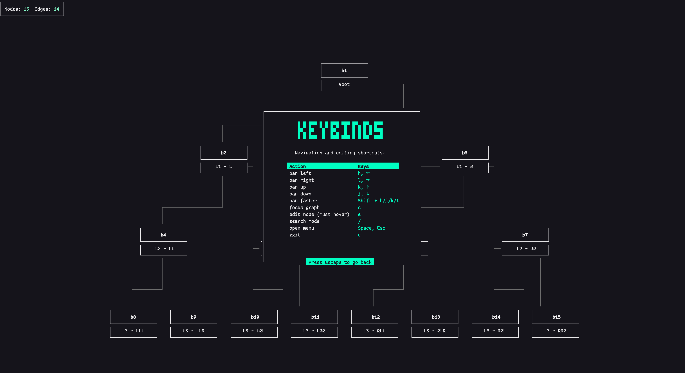
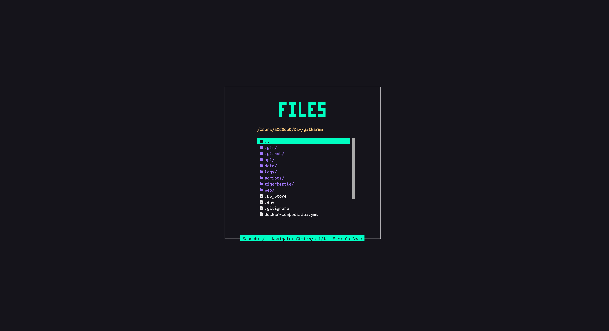
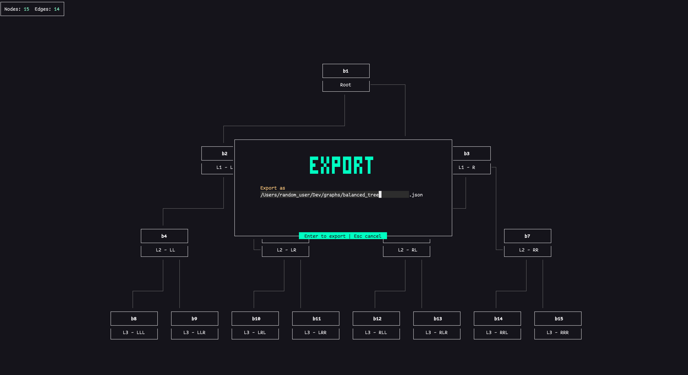
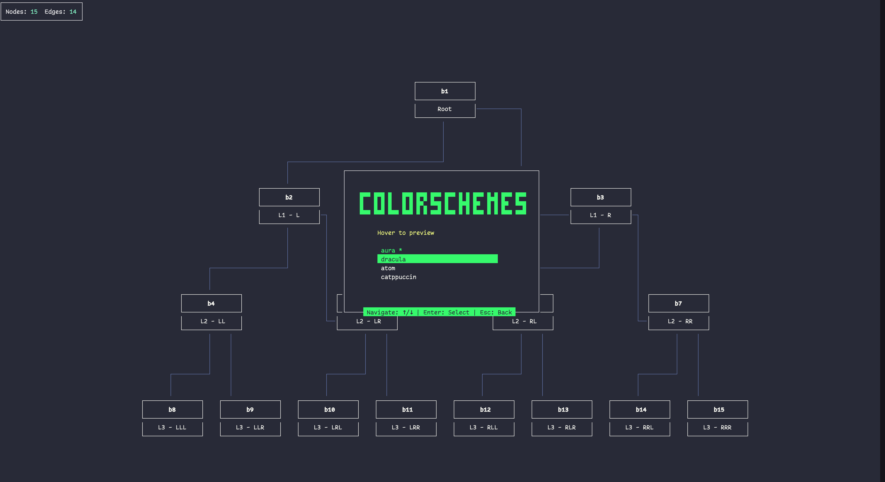
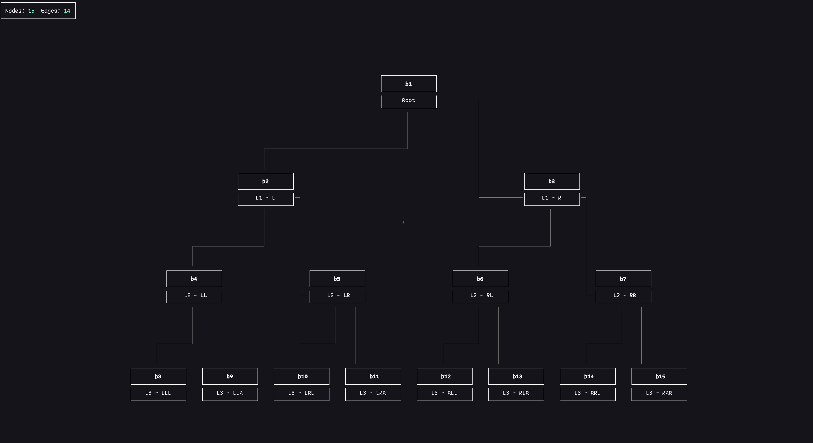

<p align="center">
  
</p>

<h1 align="center">CosmoFlow</h1>

<p align="center">
  Visualize and explore graphs and trees right in your terminal. Fast, interactive, and easy to use for understanding your data.
</p>

---

## Table of Contents

*   [Features](#features)
*   [Installation](#installation)
*   [Usage](#usage)
*   [Navigation](#navigation)
*   [File Formats](#file-formats)
*   [Roadmap](#roadmap-near-term)
*   [Feature Requests](#feature-requests)
*   [Screenshots](#screenshots)

`CosmoFlow` provides a fast and interactive way to explore node/edge data structures directly in your terminal. Whether you point it at a JSON/YAML file or use it programmatically, you can smoothly navigate large hierarchies and general graphs.

## Features

### Command-Line Interface (CLI)

- **Visualize Data:** Render graphs and trees from JSON or YAML files directly in your terminal.
- **Interactive Viewer:** Pan and zoom through your data with smooth, intuitive controls.
- **Search:** Quickly find nodes by their ID or value.
- **Theming:** Customize the look and feel with built-in themes (aura, dracula, atom, catppuccin).
- **Export:** Export your graph data to JSON or YAML.

### As a Package

- **Programmatic API:** Integrate `CosmoFlow` into your own projects to render graphs and trees from your own data structures.
- **Customizable:** Pass in your own nodes and edges, and configure the appearance and behavior of the graph.

## Installation

**NPM**

```bash
npm i -g cosmo-flow
```

**Yarn**

```bash
yarn global add cosmo-flow
```

## Usage

### CLI

You can use the `cosmo` command to visualize a JSON or YAML file directly in your terminal. It has the following options:

*   `--file <path-to-file>`: The path to the JSON or YAML file you want to visualize.
*   `--colorscheme <theme>`: The theme to use for the visualization. The available themes are: `aura`, `dracula`, `atom`, and `catppuccin`.

#### Examples

```bash
# Visualize a JSON file
cosmo --file mock/small_tree.json

# Visualize a YAML file with a specific theme
cosmo --file mock/small_tree.yaml --colorscheme dracula
```

### As a package
You can also use `cosmo` as a package in your project.

```typescript
import { cosmo } from "cosmo-flow";

const nodes = [
  { id: "1", value: "Hello" },
  { id: "2", value: "World" },
];

const edges = [{ id: "1-2", source: "1", target: "2" }];

cosmo({ nodes, edges });
```

## Navigation

Once the application is running, you can use the following keys to navigate:

*   **Pan:** Use the arrow keys (↑, ↓, ←, →) or `h`, `j`, `k`, `l` to pan the view.
*   **Search:** Press `/` to open the search bar and find nodes by their ID or value.
*   **Main Menu:** Press `Escape` or `Space` to open the main menu.
*   **Keybindings:** From the main menu, select "Keybindings" or press `s` to see all available commands.

## File Formats

`CosmoFlow` accepts JSON or YAML files with the following structure:

**JSON**

```json
{
  "nodes": [{ "id": "string", "value": "string" }],
  "edges": [{ "id": "string", "source": "string", "target": "string" }]
}
```

**YAML**

```yaml
nodes:
  - id: b1
    value: Root
  - id: b2
    value: L1 - L
  - id: b3
    value: L1 - R
edges:
  - id: be1
    source: b1
    target: b2
  - id: be2
    source: b1
    target: b3
```

The `nodes` array should contain objects with an `id` and a `value`. The `edges` array should contain objects with an `id`, a `source` (which is the `id` of the source node), and a `target` (which is the `id` of the target node).

## Roadmap (near term)

- In-place editing (add / delete / rename)
- Edge rewire operations
- Save back to file after interactive edits
- Live reload when source file changes
- Custom theme injection
- Layout options (horizontal / vertical / layered)
- Export to SVG / PNG

## Feature Requests

Have an idea for a new feature? We'd love to hear from you! The best way to suggest a new feature is to open an issue on our GitHub repository.

When you open an issue, please provide a clear and detailed description of the feature you'd like to see. Explain why you think it would be a valuable addition to `CosmoFlow`, and if possible, provide a simple example of how it might work.

We appreciate your feedback and contributions to making `CosmoFlow` even better!

## Screenshots

| Main Menu | Keybindings |
| --- | --- |
|  |  |

| File Explorer | Export |
| --- | --- |
|  |  |

| Colorschemes | Graph Example |
| --- | --- |
|  |  |
